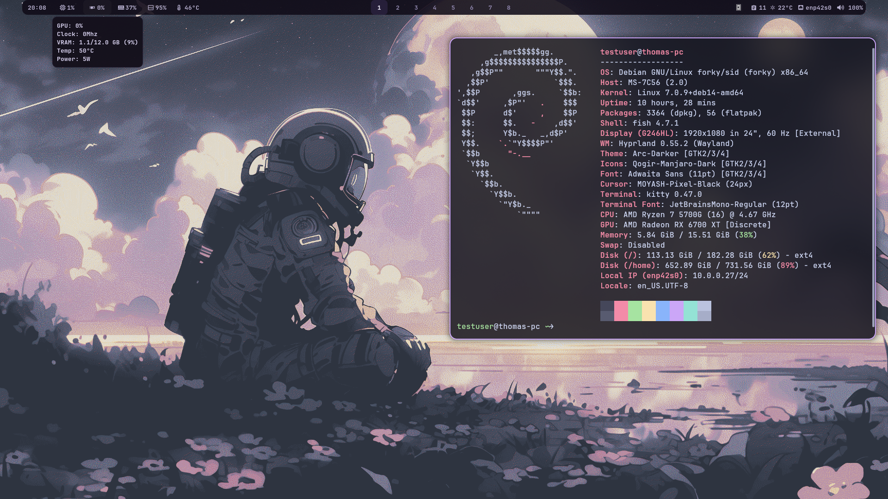

# Hyprland Dotfiles for Debian

A simple Hyprland setup for Debian Testing (forky) with a purple aesthetic.



## Packages

```bash
apt install hyprland hyprpaper hypridle wlogout kitty wofi waybar cliphist wl-clipboard hyprlock grim slurp 
````

## Required packages (recommended extras)

```bash
apt install btop nvtop ncdu nmtui starship yazi
```

## Fonts

JetBrainsMono Nerd Font is recommended for proper icons in Waybar and terminal tools.

## Weather API (optional)

For the weather module you need an OpenWeatherMap API key:

* Create a free account: [https://openweathermap.org/api](https://openweathermap.org/api)
* Generate an API key
* Add it to the weather script

## Installation

Move the dotfiles into your `~/.config` directory.

## Wallpapers

[https://0xnotkyo.github.io/walls/](https://0xnotkyo.github.io/walls/)

